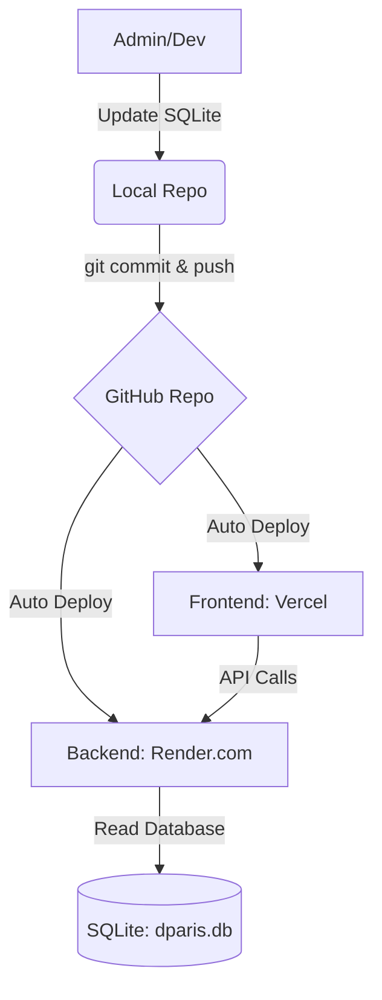

# 🌄 D’PARIS EGSOTIS
[](https://huggingface.co/spaces/prayphnadeak/dparis-egsotis)
## Direktori Statistik Pariwisata Berbasis GPS & Infografis  
Progressive Web App (PWA) – VueJS + Python Backend

---

## 📌 Deskripsi Aplikasi

**D’PARIS EGSOTIS (Direktori Statistik Pariwisata dengan Pemanfaatan GPS dan Unsur Infografis)** adalah aplikasi berbasis **Progressive Web Apps (PWA)** yang menyediakan direktori statistik pariwisata Kota Pagar Alam.

Aplikasi ini dirancang untuk:
- Menyediakan informasi akomodasi, wisata, dan kuliner
- Menampilkan infografis statistik pariwisata
- Terintegrasi dengan layanan WhatsApp CADAS Besemah
- Menyediakan kanal pengaduan publik
- Memanfaatkan koordinat GPS untuk navigasi lokasi

Sistem dibangun menggunakan:
- **Frontend:** VueJS 3 (PWA)
- **Backend:** Python (FastAPI / Django REST)
- **Database:** SQLite (dparis.db)

---

# 🏗️ Arsitektur & Deployment

### 🌐 Skema Hosting


### 🚀 Satu-Klik Deploy
| Service | Action |
| --- | --- |
| **Frontend** | [](https://vercel.com/new/clone?repository-url=https%3A%2F%2Fgithub.com%2Fprayphnadeak%2Fdparis-egsotis&root-directory=frontend) |
| **Backend** | [](https://render.com/deploy?repo=https://github.com/prayphnadeak/dparis-egsotis) |

---

## 💻 WORKFLOW UPDATE DATA
1. Buka folder `backend/`
2. Update data di file `dparis.db` (menggunakan DB Browser for SQLite atau script python)
3. Lakukan Push ke GitHub:
   ```bash
   git add backend/dparis.db
   git commit -m "Update database wisata"
   git push origin main
   ```
4. Vercel & Render akan otomatis melakukan **Redeploy** dengan data terbaru.

---

# 🖥️ FRONTEND REQUIREMENTS

## 🛠️ Teknologi

- VueJS 3 (Composition API)
- Vue Router
- Pinia (State Management)
- Axios
- Vite
- vite-plugin-pwa
- TailwindCSS / Vuetify
- Leaflet.js / Google Maps API

---

# 🧠 BACKEND REQUIREMENTS

## 🛠️ Teknologi

- Python 3.10+
- FastAPI
- SQLAlchemy
- SQLite
- JWT Authentication
- Uvicorn
- Docker

---

# 📦 ENVIRONMENT VARIABLES

### Frontend (`frontend/.env`)
```
VITE_API_URL=https://your-backend-url.onrender.com
```

### Backend (`backend/.env`)
```
DATABASE_URL=sqlite:///./dparis.db
SECRET_KEY=your-secret-key
```

---

# 🎯 KESIMPULAN

D’PARIS EGSOTIS adalah sistem:

✔️ Direktori Pariwisata  
✔️ Berbasis Statistik  
✔️ Terintegrasi GPS  
✔️ Berbasis Progressive Web App  
✔️ Siap dikembangkan menjadi Smart Tourism Platform  

---